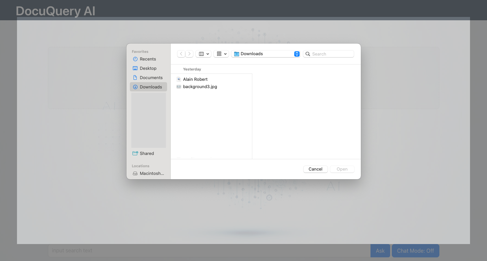
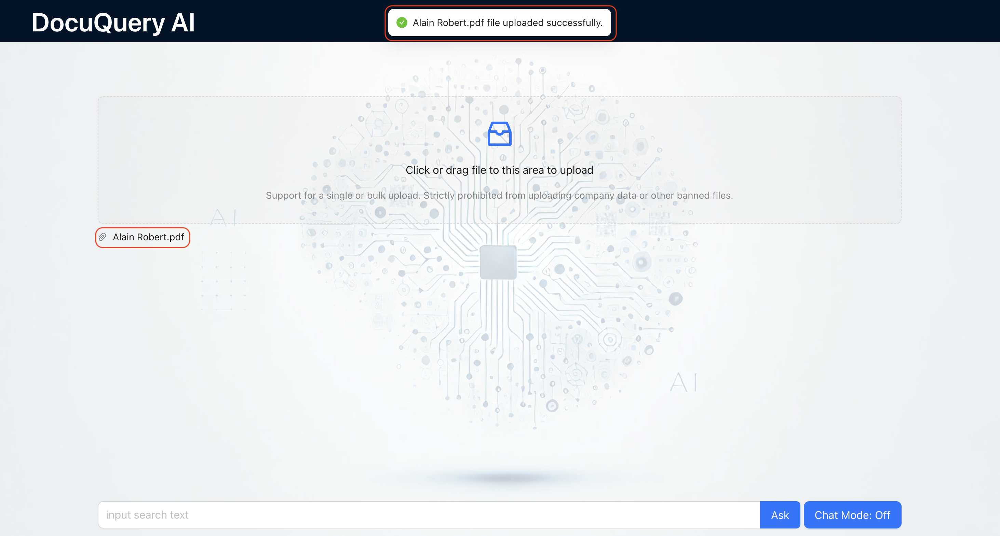
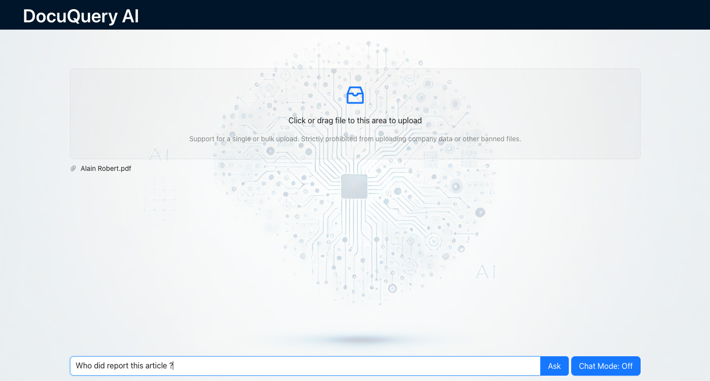
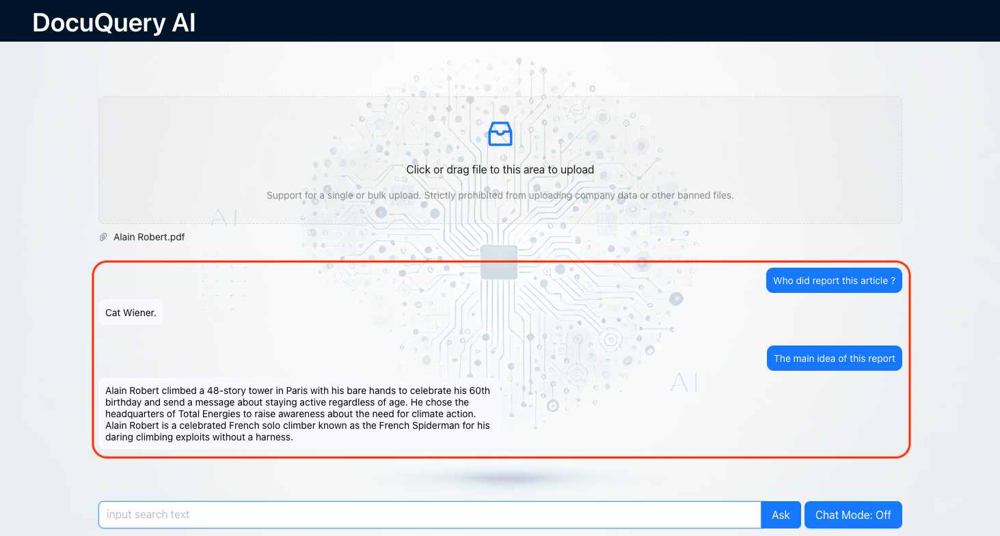
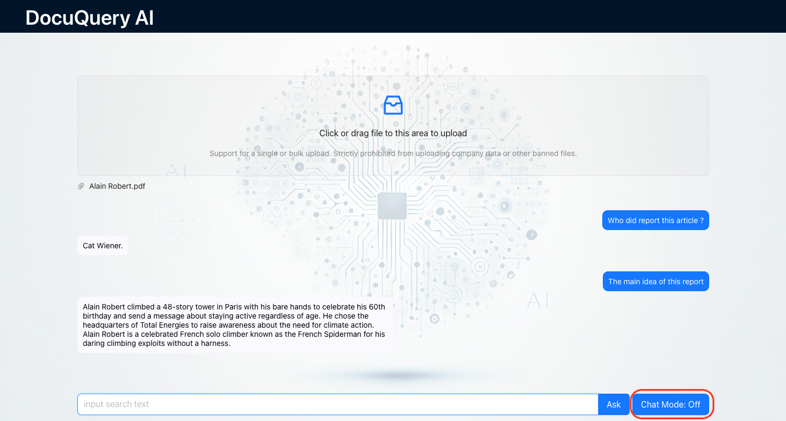
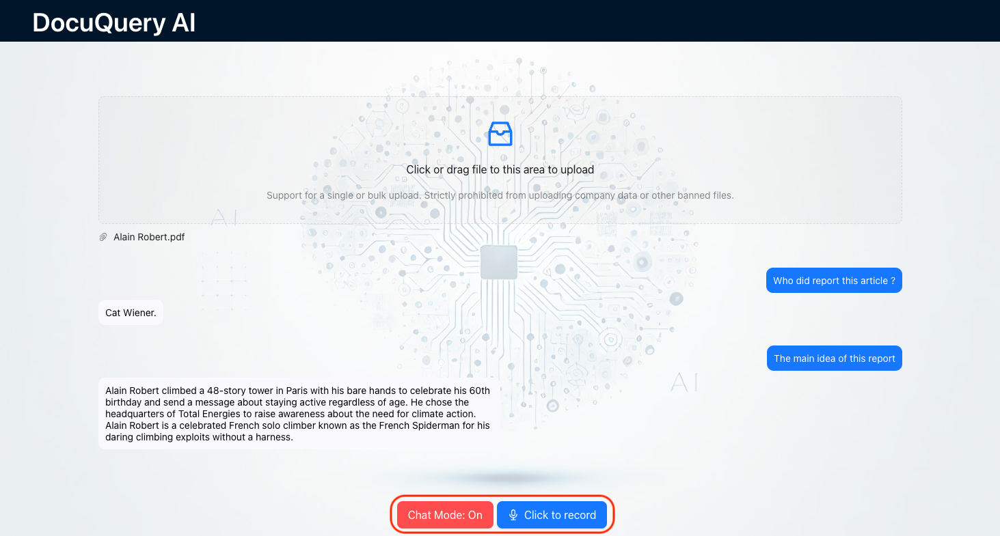
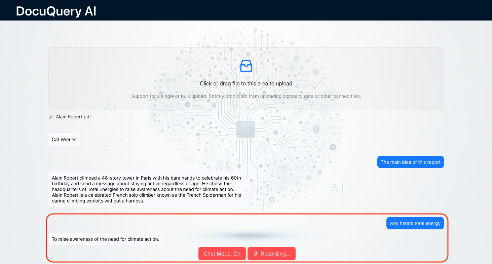

# DocuQueryAI: Real-Time Document Q&A AI Agent with Text and Voice

**DocuQueryAI** empowers users to get answers from uploaded documents through an intuitive web interface. Ask questions in either text or voice, and receive intelligent,  context-aware responses in real-time.

Welcome to the frontend repository of the DocuQueryAI. The backend code can be found [here](https://github.com/lan234234/DocuQueryAI-Backend).

**Visit DocuQueryAI:** [DocuQueryAI](https://docu-query-ai.vercel.app/)

## Features
- **Document Upload:** Easily upload PDF documents to the platform.
- **Question and Answer:** Ask questions about your uploaded documents in both text and voice formats.
- **Real-Time Responses:** Receive intelligent, context-aware answers instantly.
- **Voice Interaction:** Enjoy a seamless conversational experience with voice-based queries and responses.

## Demo
Explore screenshots from DocuQueryAI showcasing each of our core features:

### Document Upload
#### Upload Document

*Interface for upload document.*

*Choose document.*

*Upload document successfully.*

#### Delete Document

*Delete uploaded document.*

### Real-Time Question and Answer

*Type in question.*

*Real-time question and answer.*

### Voice Interaction

*Start chat mode.*

*Start voice recording.*

*Voice-based interaction.*

## Technologies Used
- **Backend:** Express.js (Node.js)
- **Frontend:** React, HTML, CSS, JavaScript, Ant Design
- **Natural Language Processing:** OpenAI's GPT-3.5 Turbo API (for AI processing)
- **Voice Interaction:** Web Speech API, React Speech Recognition library, speak-tts library
- **Data Storage:** in-memory vector

## License
MIT License
